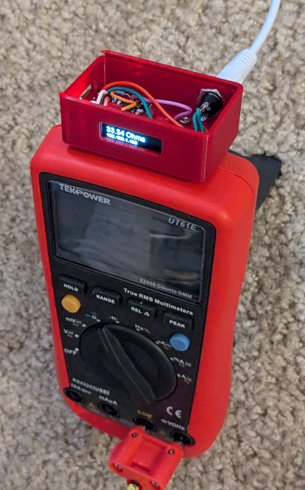
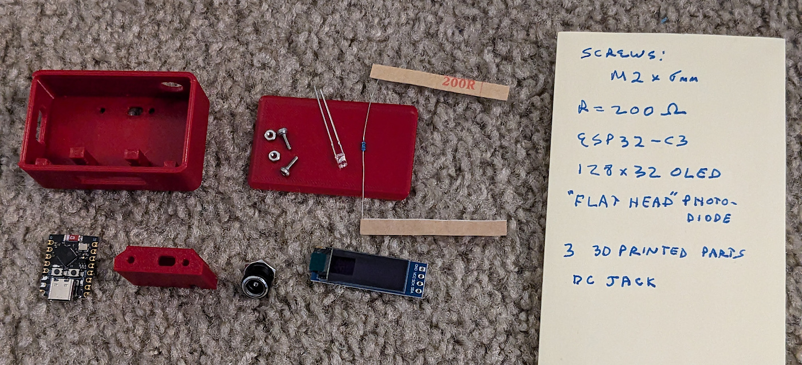
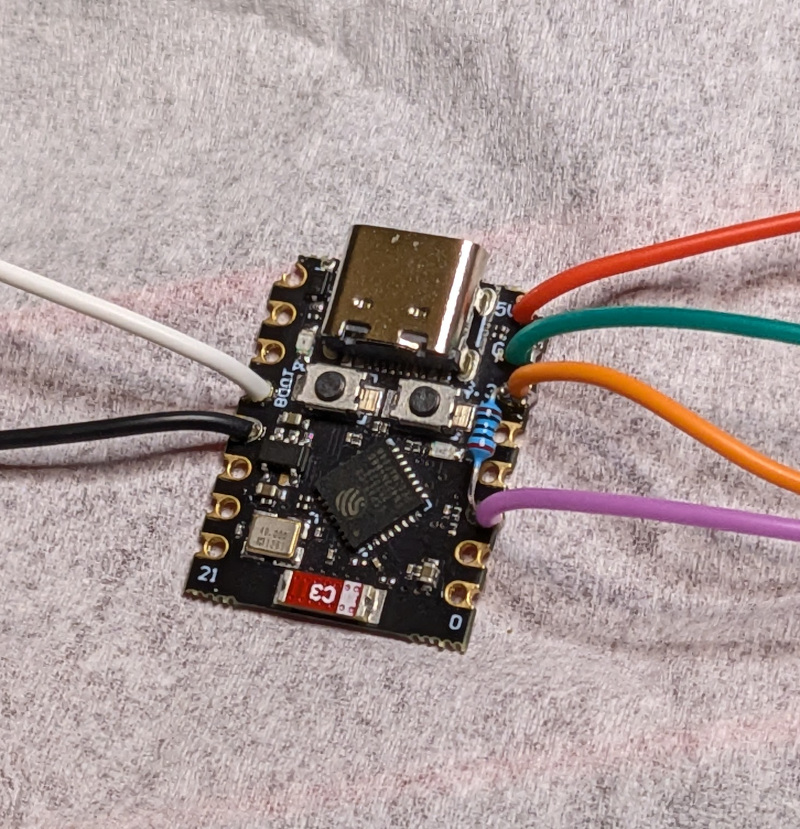
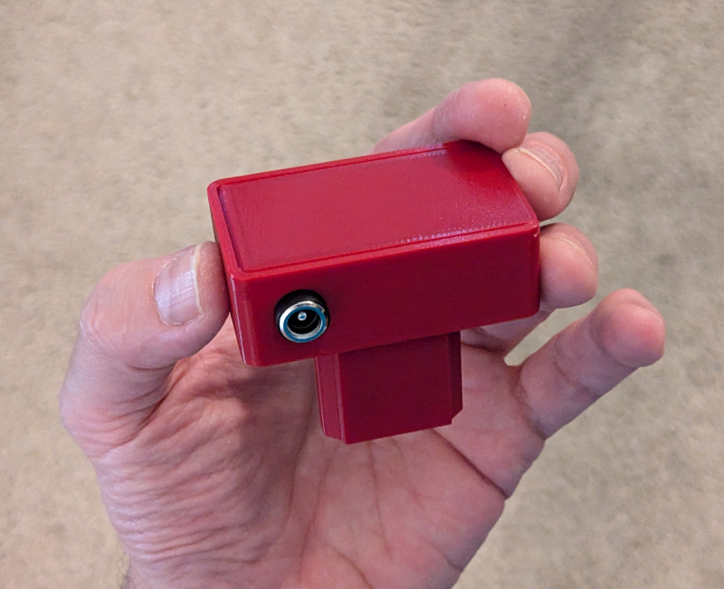

# UNI-T Multimeter Digital Interface

## Optical plug-in module for the UT-61e (and similar) series of Multimeter.

This is a wireless (wifi, web/REST) interface that allows remote reading of the current multimeter value, including its mode.

Optionally, it can also interface with a wireless footswitch (pedal).  This can trigger a network message being sent (mqtt, etc) as well as an optional trigger sent to a speech synthesizer.  Both of those projects are also Arduino/esp32 based.

Parts needed are simple:

